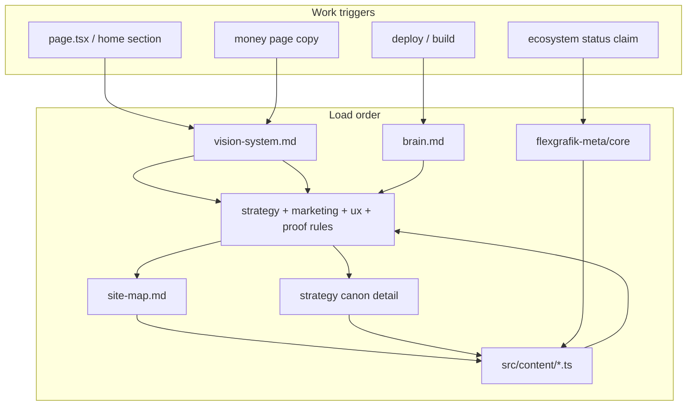

# Authority Chain

Defines which document wins when sources disagree. Pattern: governance-first context engineering (IBM ISG + Google agent context layers).

---

## Retrieval graph

---

## Conflict resolution table

| Situation | Winner | Loser |
|-----------|--------|-------|
| Meta AS-IS vs services copy | `flexgrafik-meta/docs/core/as-is-inventory.md` | Any portfolio claim |
| HARD rule vs strategy narrative | `docs/canons/*-rules.md` | Long-form strategy (detail only) |
| `site-map.md` §2 vs `page.tsx` | `site-map.md` (update code to match) | Ad-hoc section order |
| `src/content/*.ts` vs docs (live UI) | `src/content/*.ts` | Stale doc text |
| `vision-system.md` vs `brain.md` (direction) | `vision-system.md` | `brain.md` |
| `brain.md` vs strategy (tech/deploy) | `brain.md` | Strategy |
| Handoff vs canon | Canon layers L0–L3 | Old handoff |
| Commander explicit decision | Commander | All docs (until canon updated) |

---

## Triggers — what to load

| Trigger | Minimum load set |
|---------|------------------|
| Home / section work | vision → strategy-rules → site-map → ux-rules → ecosystem.ts |
| Money page copy | vision → marketing-rules → marketing-strategy → conversion-copy.ts |
| New route | og-route skill + site-map §5 + strategy-rules SR-09 |
| Proof / metrics | proof-rules → proof.ts → meta traction-honesty |
| Ecosystem status badge | meta as-is-inventory → readiness.ts → proof-rules |
| Deploy / CI | brain.md §7–§9 → verify skill |
| Session bootstrap | docs/README.md → SESSION-ANCHOR → latest handoff |

---

## Agent duty on conflict

1. Stop implementation
2. Label: `KONFLIKT Z [doc-id]` (e.g. `MR-07`)
3. Cite winner doc + loser doc
4. Propose fix aligned to winner
5. If Commander decision needed → note in handoff, do not ship ambiguous copy

---

*Cross-ref: [doc-lifecycle.md](../governance/doc-lifecycle.md) · [docs/README.md](../README.md)*
