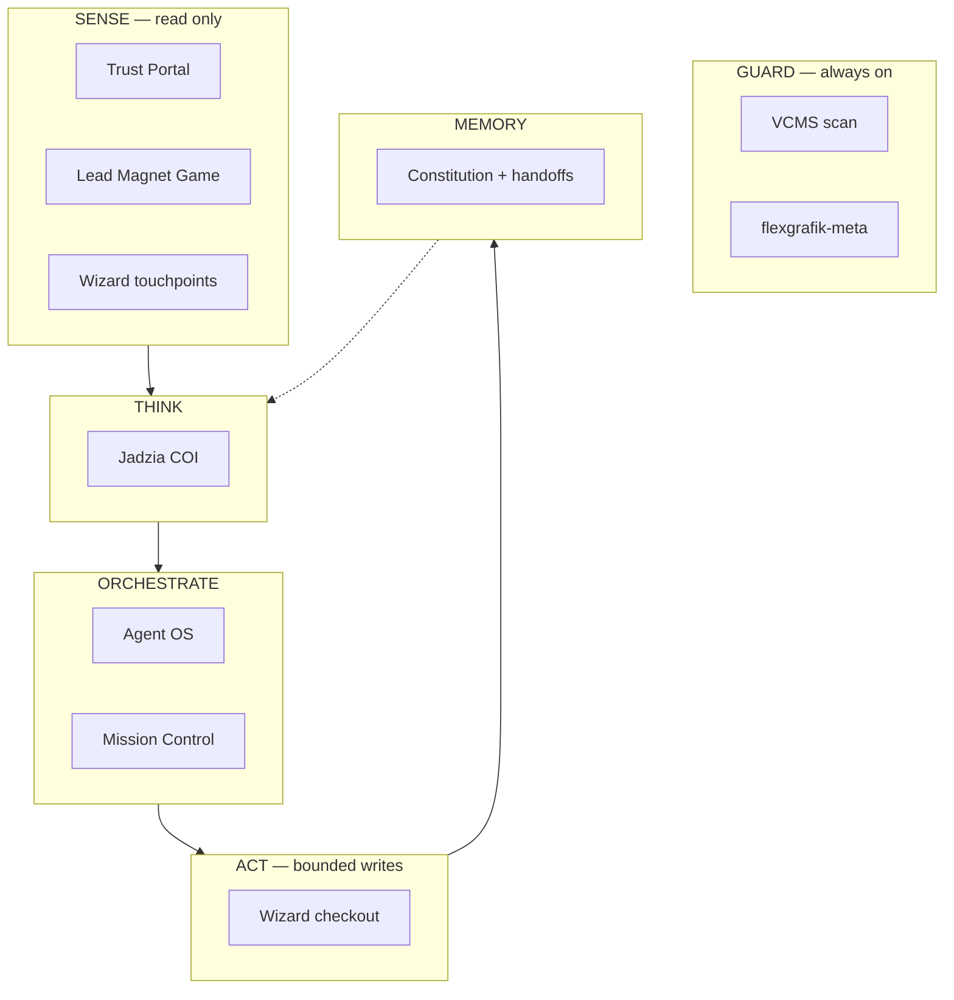

# UX/UI Audit — Interactive LOS Diagram

**Data:** 2026-07-08  
**Audytor:** Systems diagram specialist (C4 / swimlane / progressive disclosure)  
**Scope:** `LivingSystemDiagram` — `/founder/#system-diagram`, `/results/owner-ecosystem/#los`  
**Persona:** Dowódca + LinkedIn tech visitor — ma zrozumieć system w **< 30 sekund**, bez wcześniejszej wiedzy o repo keys.

---

## Werdykt

| Wymiar | Ocena | Komentarz |
|--------|-------|-----------|
| **Funkcjonalność** | ✅ PASS | Klik, panel, toggle, mobile accordion, fallback SVG/PDF |
| **Czytelność (główny problem)** | ❌ FAIL | „Totalnie mało czytelny” — uzasadnione |
| **Zgodność ze static SSoT** | ❌ FAIL | `los-architecture.svg` jest modelem; interactive go nie odwzorowuje |
| **Audience fit (founder/SMB)** | ❌ FAIL | Default = najgęstszy widok; za dużo frameworków naraz |

**Podsumowanie jednym zdaniem:** Diagram ma dobre dane i interakcje, ale **zły model wizualny** — force-directed graph z 11 krawędziami zamiast swimlane’ów, które już działają w static SVG.

---

## Co jest DOBRE (zachować)

1. **`system-diagram.ts` jako SSoT** — copy, statusy, INT edges, proof routes. Nie ruszać treści, tylko prezentację.
2. **Honest labels** — LIVE / PARTIAL / PLANNED bez marketingowego szumu.
3. **Progressive disclosure w panelu** — North Star → AS-IS → TO-BE → proof/demo po kliknięciu.
4. **Dwa widoki (Architecture / SMB Funnel)** — właściwa idea, zła kolejność i implementacja funnel.
5. **Mobile accordion** — właściwy fallback; lista + expand lepsza niż gęsty SVG.
6. **Static SVG/PDF fallback** — LinkedIn/download artefakt zostaje.
7. **Walk the loop** — dobry koncept edukacyjny, ale **nie nad diagramem** (patrz P0).

---

## Diagnoza — dlaczego jest nieczytelny

### 1. Model wizualny: graph zamiast swimlane (KRYTYCZNE)

**Static SVG** (`public/gratka/los-architecture.svg`) używa sprawdzonego wzorca:

- Guard **na górze** jako persistent strip (nie na dole)
- Sense → Think → Orchestrate → Act → Memory jako **poziome pasy**
- Repo **wewnątrz** pasów, w rzędach
- **4–5 strzałek pionowych** między warstwami, nie 11 INT edge’ów krzyżujących canvas

**Interactive** wrzuca nody na losowe `(x,y)` z JSON i rysuje wszystkie INT jako quadratic Bézier → **spaghetti**.

```
Static:     [==== GUARD ====================================]
            [ SENSE: portal | game | wizard | vcms scan    ]
            [ THINK: jadzia ] [ ORCHESTRATE: agent-os | ui ]
            [ ACT: bounded writes                          ]
                         ↓  ↓  ↓  (kilka strzałek)

Interactive:  ○──╮
                ╰──○──╮──○  (11 krawędzi, krzyżują się)
              ○──╯    ╰──○
```

### 2. Warstwy LOS są dekoracją, nie semantyką (KRYTYCZNE)

`los-diagram-layout.json` ma bandy Sense/Think/…, ale nody **nie siedzą w pasach**:

| Node | Layer (data) | Y position | Pas wizualny |
|------|--------------|------------|--------------|
| flex-vcms | guard | 72 | Sense ❌ |
| zzpackage | act | 400 | Act ✅ |
| quietforge | service | 620 | poza Memory ❌ |

Użytkownik widzi etykiety „SENSE”, „GUARD”, ale nody w nich nie leżą → **fałszywa mapa poznawcza**.

### 3. Za dużo frameworków naraz (WYSOKIE)

Jednocześnie na ekranie:

1. Life loop (7 faz) + przycisk Walk
2. Architecture / SMB toggle
3. 6 warstw LOS
4. 3 brains (Governance / Operations / Engineering) — 9px tekst bez ramek
5. 9 nodów + 11 krawędzi INT
6. Panel szczegółów

To **4–5 mental models** — dla C4/swimlane max **1 główny + 1 drill-down**.

### 4. Krawędzie niewidoczne bez hover (WYSOKIE)

INT-001…013 istnieją tylko jako cienkie linie; label `INT-003: Coupon bridge` pojawia się **dopiero po hover**. Bez interakcji diagram wygląda jak losowy graf.

**Reguła systems design:** albo pokazujesz **hero path** (3–5 strzałek), albo chowasz resztę za „Show integrations (13)”.

### 5. Nody homogeniczne — brak hierarchii skanowania (ŚREDNIE)

Wszystkie prostokąty 148×52, ten sam styl. Brak:

- wyróżnienia **spearhead** (Wizard) vs infrastructure (meta)
- koloru warstwy w tle noda
- ikon roli (sense / act / guard)
- `StatusBadge` komponentu w SVG (tylko mono tekst 9px)

### 6. Default view = Architecture (WYSOKIE dla /founder)

Founder page = credibility dla SMB + LinkedIn mixed. **Architecture** jest widokiem dla inżyniera. SMB Funnel / uproszczony „Story” powinien być default na `variant="founder"`.

### 7. Life loop nad grafem konkuruje o uwagę (ŚREDNIE)

Pasek Sense→…→Learn jest wartościowy, ale **przed** diagramem kradnie fold. Lepiej: collapsible „How the loop works” **pod** diagramem lub jako overlay krokowy (1 warstwa na raz).

### 8. Brak legendy i tytułu w canvas (ŚREDNIE)

Static ma: tytuł, subtitle, footer legend. Interactive — pusty `#0a0a0a` bez kontekstu „co patrzę”.

---

## Benchmark — static SVG vs interactive

| Element | Static SVG ✅ | Interactive ❌ |
|---------|---------------|----------------|
| Guard position | Top banner | Bottom band, słabo widoczny |
| Nodes in lanes | Tak | Nie |
| Edge count visible | ~5 flow arrows | ~11 INT crossings |
| Layer subtitles | Tak („GA4, WC, Game…”) | Brak |
| Title + legend | Tak | Brak |
| Multi-appearance repo | zzpackage w Sense+Act | Pojedyncza instancja |
| Repo keys vs names | Keys (OK dla tech PDF) | Mix label/shortLabel |

**Wniosek:** Interactive powinien **wyglądać jak static SVG + klikalność**, nie jak nowy layout od zera.

---

## Plan optymalizacji UX/UI

### Faza P0 — Czytelność w 1 sesji (~4–6h) — MUST

**Cel:** Ten sam diagram co static, ale klikalny.

| # | Zmiana | Implementacja |
|---|--------|---------------|
| P0.1 | **Swimlane layout** | Przepisać `los-diagram-layout.json`: sloty `{layer, row, col}` zamiast free `(x,y)`. Nody snap do środka pasu. |
| P0.2 | **Guard na górze** | Jak static: pełna szerokość, zielony/amber strip, tekst „HITL before production writes”. |
| P0.3 | **Hero edges only (default)** | Pokaż 5 strzałek flow: Sense↓Think↓Orchestrate↓Act↓Memory. Reszta INT w toggle „Show 13 integrations”. |
| P0.4 | **Founder default = Story** | `variant="founder"` → default `smb_funnel` lub nowy view `story` (6 kroków z `OWNER_FLOW_STEPS`). Architecture = „Technical view”. |
| P0.5 | **Tytuł + legenda w SVG** | Nagłówek: „Living Operating System” + 1 linia subtitle. Footer: „Click any module for proof”. |
| P0.6 | **Life loop → collapsible** | `<details>` lub accordion pod diagramem; domyślnie zwinięty na founder. |

**DoD P0:** Dowódca patrzy 15s na `/founder/` i potrafi powiedzieć: portal → game → wizard → jadzia → governance.

---

### Faza P1 — Skanowanie i polish (~3–4h)

| # | Zmiana | Implementacja |
|---|--------|---------------|
| P1.1 | **StatusBadge w nodach** | HTML overlay lub SVG foreignObject z istniejącym `StatusBadge`. |
| P1.2 | **Warstwa = kolor tła noda** | Sense=neutral, Act=amber border, Guard=green tint, Memory=blue dash. |
| P1.3 | **Human labels always** | `Wizard` nie `zzpackage` na founder; repo key w panelu / tooltip. |
| P1.4 | **3 brains jako ramki** | Zamiast 9px tekstu: 3 półprzezroczyste regiony obejmujące nody (Governance | Ops | Engineering). |
| P1.5 | **Edge labels on hero path** | Stałe etykiety przy 5 głównych strzałkach (nie tylko hover). |
| P1.6 | **Panel pod diagramem (founder)** | Zamiast kolumny z prawej — panel slide-up pod SVG → pełna szerokość grafu. |

---

### Faza P2 — Power user (~2–3h, opcjonalne)

| # | Zmiana |
|---|--------|
| P2.1 | Filter: LIVE only / show PLANNED |
| P2.2 | „Walk the loop” synchronizuje highlight pasu LOS (nie tylko chips) |
| P2.3 | Mini-map lub zoom dla owner-ecosystem `variant="full"` |
| P2.4 | INT edge list jako tabela pod diagramem (ID, from→to, status) — dla accountant/dev forward |

---

## Proponowany layout (P0) — mermaid



INT-001…013: **panel boczny / modal** po włączeniu „Show integrations”, nie na głównym canvas.

---

## Kolejność widoków (po optymalizacji)

| Widok | Kto | Default na |
|-------|-----|------------|
| **Story** (6 kroków OWNER_FLOW) | SMB, founder | `/founder/` |
| **Architecture** (swimlane jak static) | Tech, investor | `/results/owner-ecosystem/#los` |
| **Integrations** (tabela INT) | Dev forward | toggle w Architecture |

Usunąć lub zmergować obecny „SMB Funnel” horizontal scroll — zastąpić **Story** z numerowanymi krokami (jak static funnel, nie graf).

---

## Metryki sukcesu (po P0)

| Test | Pass |
|------|------|
| 5-sekundowy test | Użytkownik wskaże „gdzie klient kupuje” bez klikania |
| 15-sekundowy test | Opisze flow portal → wizard → jadzia |
| Porównanie ze static | Side-by-side screenshot — layout lanes match ≥80% |
| Founder bounce | Nie wymaga horizontal scroll całej strony (tylko opcjonalny w canvas) |
| `audit-los-diagram.mjs` | PASS (zaktualizowany pod swimlane) |

---

## Co NIE robić

- ❌ `@xyflow/react` / force-directed auto-layout — więcej chaosu, gorszy static export
- ❌ Więcej tekstu na canvas — copy zostaje w panelu
- ❌ Usuwanie honest PLANNED — tylko lepsze visual weight (dashed, muted)
- ❌ Diagram na home (SR-02)

---

## Następny krok

**Sesja implementacji P0** (1-1-1): swimlane layout + hero edges + founder default Story + collapsible life loop.

Szacunek: **4–6h agent work**, jeden moduł `LivingSystemDiagram` + `los-diagram-layout.json` + ewentualnie `DiagramStoryView.tsx`.

---

## Załącznik — pliki do zmiany (P0)

| Plik | Akcja |
|------|--------|
| `docs/design/los-diagram-layout.json` | REWRITE — swimlane slots |
| `src/components/diagram/LivingSystemDiagram.tsx` | Swimlane renderer, hero edges, collapsible loop |
| `src/components/diagram/DiagramStoryView.tsx` | CREATE — 6-step founder default |
| `src/content/system-diagram.ts` | `heroEdges` vs `allEdges`, `displayLabel` per variant |
| `src/app/founder/page.tsx` | `defaultView="story"`, krótszy lead copy |
| `scripts/audit-los-diagram.mjs` | Update assertions |

**Referencja wizualna:** `public/gratka/los-architecture.svg` — design truth dla P0.
