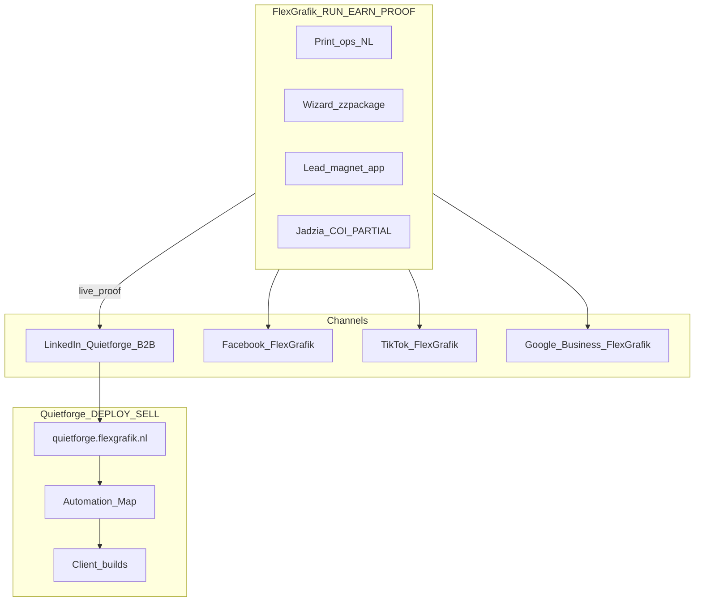
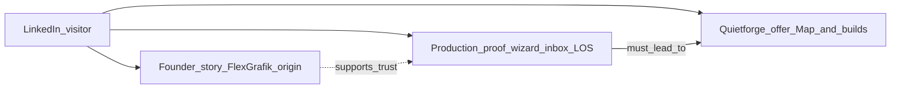

# Two-Brand Model

---

## CO

Dwa brandy, jedna rzeczywistość operacyjna:

| Brand | Rola GTM | Jedno zdanie | Status na stronie głównej (2026-06-30) |
|-------|----------|--------------|----------------------------------------|
| **FlexGrafik** | RUN + EARN + **PROOF** | Holenderska drukarnia / ZZP — na niej **działa** silnik (wizard, inbox, LOS). | **Proof layer** — `DualBrandBand` §2, `/results/`, founder story |
| **Quietforge** | DEPLOY + EXPLAIN + **SELL B2B** | Conversion Systems Architect — **wdraża** ten sam typ systemu u innych NL SMB. | **Primary w hero** — Problem→System→Effect, de-jargon, L3 Map (v3.0 ✅) |

Profil LinkedIn: [linkedin.com/in/flexgrafik-quietforge](https://www.linkedin.com/in/flexgrafik-quietforge) — **jedno konto**, oba brandy widoczne, ale **job sprzedażowy = Quietforge**.

---

## DLACZEGO

1. **Kupujący B2B** pyta: *„Czy ten architekt dowozi system, który poprawia mój biznes?”* — nie *„czy drukuje naklejki?”*
2. **Bez żywej firmy** Quietforge brzmi jak agencja z deckiem. FlexGrafik jest **laboratorium produkcyjnym**, nie case study mock-up.
3. **Jeden LinkedIn** ma sens: każdy zainteresowany automatyzacją widzi, że silnik **pracuje na prawdziwej firmie** — to główny moat ([marketing-strategy.md](../marketing-strategy.md) §10, self-as-client).

Skomplikowanie jest **funkcjonalne**, nie do „uproszczenia” przez jeden consumer pitch na wszystkich kanałach.

---

## BO

- Jeśli LinkedIn = oferta druku → trafiasz ZZP szukających oklejenia, nie architekta systemów (audyt: stare posty flexgrafik.nl, magnesy — 44–101 imp, zły ICP).
- Jeśli Quietforge bez FlexGrafik → brak wiarygodności LIVE/PARTIAL ([proof-rules.md](../../canons/proof-rules.md)).
- Jeśli FlexGrafik bez Quietforge na LinkedIn → marnujesz kanał B2B (priorytet A).

**Reguła z vision-system §2:** Quietforge **deploys and explains**; FlexGrafik **runs and earns**.

---

## Diagram — jak to działa razem



---

## Diagram — co widzi odbiorca na LinkedIn



**Kolejność narracji na feedzie (docelowa):** Problem → System → Effect → **Book Automation Map** — nie odwrotnie.

---

## Diagram — idealny przepływ z homepage (docelowy)

```text
[5 sek]  HERO: Problem → System → Effect  +  L3 Book Map
              ↓
         DUAL-BRAND BAND
         Quietforge = sell B2B  |  FlexGrafik = live proof (not print pitch)
              ↓
         FEATURED STRIP (3 cards)
         Map €290  ·  /results/ LIVE  ·  Wizard proof
              ↓
         PROOF MODULES (LIVE/PARTIAL badges)
              ↓
         IntentRouter (problem pick) — BELOW fold, not hero
              ↓
         L3 sticky / footer CTA → /book-discovery/
```

**Stan live (2026-06-30):** Homepage v3.0 shipped — dual-brand band, Featured strip, de-jargon hero, LIVE/PARTIAL badges. Szczegóły: [gtm/README.md](./README.md) gap table ✅.

**Historyczny audyt (pre-v3.0):** [quietforge-ux-ia.md](../../audits/2026-06-25/quietforge-ux-ia.md) — użyj tylko jako before snapshot.

---

## Kanały × brand (skrót)

Pełna tabela: [02-channel-architecture.md](./02-channel-architecture.md).

| Kanał | Główny brand | FlexGrafik na tym kanale |
|-------|--------------|---------------------------|
| LinkedIn | Quietforge B2B | Tylko jako **proof** i founder context |
| Facebook | FlexGrafik | Primary — druk, ZZP, lokalnie | [../facebook/README.md](../facebook/README.md) |
| TikTok | FlexGrafik | Primary — wizualny druk / ZZP |
| Google Business | FlexGrafik | Primary — lokalne usługi |
| quietforge.flexgrafik.nl | Quietforge | FlexGrafik w /results/, /founder/ |

---

## Audyt LinkedIn jako kontekst (2026-06-29)

| Obserwacja | Implikacja strategiczna |
|------------|-------------------------|
| Positioning copy ~4.2/5 | **Nie przepisywać tożsamości** — kierunek OK |
| B2B readiness 2.4/5 | **Luka = konwersja i treść feedu**, nie „kim jesteś” |
| Feed investor-heavy, 0× quietforge link | **Rozjazd kanału z priorytetem A** — naprawa przez **nową treść**, nie kasowanie historii |
| Brak Featured / jawnego Map CTA | Strategia mówi *dokąd* prowadzić; wykonanie profilu osobno |
| **Homepage dual-brand consistency** | **✅ CLOSED (v3.0):** dual-brand band, Featured strip, de-jargon hero — verify prod before LI scale |

Źródła: [linkedin-audit-2026-06-29.md](./audits/linkedin-audit-2026-06-29.md) · [quietforge-ux-ia.md](../../audits/2026-06-25/quietforge-ux-ia.md)

---

## NIE (anty-wzorce)

| NIE | Dlaczego |
|-----|----------|
| „Jedna marka, jeden pitch” na wszystkich kanałach | Rozmywa B2B i consumer |
| LinkedIn post: „zamów oklejenie / magnesy” | Kanał consumer — FB/TikTok/GMB |
| Quietforge bez wzmianki że system **żyje** na FlexGrafik | Brzmi jak software house |
| FlexGrafik jako **główna oferta** na LinkedIn | Mylisz ICP z drukarnią |
| Procent „80% gotowe” zamiast LIVE/PARTIAL | [proof-rules.md](../../canons/proof-rules.md) — honesty gate |
| Investor ask na głównym feedzie B2B | [08-investor-track.md](./08-investor-track.md) — osobna ścieżka |
| **Mieszanie consumer pitch na stronie Quietforge** | Homepage ≠ flexgrafik.nl — brak CTA druku, brak „zamów oklejenie”; FlexGrafik tylko jako **proof layer** w /results/, dual-brand band, founder story |

---

## Powiązane dokumenty

- [vision-system.md](../../canons/vision-system.md) §2 — binding two-brand
- [marketing-strategy.md](../marketing-strategy.md) — ICP, pricing, message hierarchy
- [02-channel-architecture.md](./02-channel-architecture.md)
- [03-linkedin-principles.md](./03-linkedin-principles.md)
