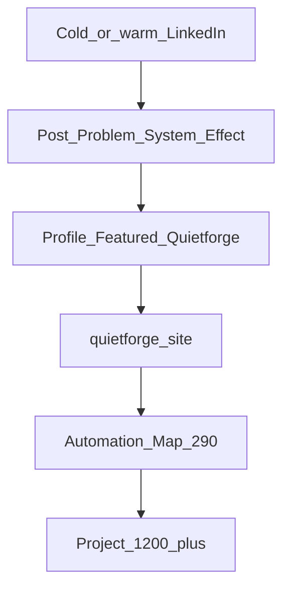

# Channel Architecture

---

## CO

Mapa **który kanał służy któremu brandowi**, z jakim CTA i czego **nie** publikować.

---

## DLACZEGO

Masz jeden ekosystem (8 repo, LOS), ale **odbiorcy są różni**: NL ZZP kupujący druk ≠ właściciel SMB szukający automatyzacji inboxu. Jeden feed „o wszystkim” obniża zaufanie i konwersję (audyt: feed = founder + investor + consumer mix).

---

## BO

Kanał bez przypisanej roli **zawsze** wraca do najłatwiejszego contentu (druk, pity, investor) — i odciąga od priorytetu A (Automation Map €290+).

Ceny i pełny ICP: [marketing-strategy.md](../marketing-strategy.md) §3, §8.

---

## Tabela kanał × brand × CTA × NIE

| Kanał | Primary brand | Secondary (proof) | Primary CTA | Język | Częstotliwość docelowa | Aktualny stan na stronie (2026-06-29) | NIE publikować |
|-------|---------------|---------------------|-------------|-------|------------------------|---------------------------------------|----------------|
| **LinkedIn** `flexgrafik-quietforge` | Quietforge B2B | FlexGrafik jako live ops | Book Automation Map → `quietforge.flexgrafik.nl/book-discovery/` | EN | ~2 posty / tydzień | Copy OK (~4.2/5); Featured brak; feed 0× quietforge link | Oferty druku, ceny ZZP druk, #investorready na feedzie B2B, prośby o capital w treści głównej |
| **Facebook** | FlexGrafik ZZP brandingpartner | Wizard · live chat · game (stagger vs LI) | Wizard L1 / flexgrafik.nl L2 / bericht L3 | NL only | 2–3 / week launch · then 1–3 | v2.0 canon: [../facebook/README.md](../facebook/README.md) · audit 14 followers | LOS / 8-repo / Quietforge Map / investor / EN bio |
| **TikTok** | FlexGrafik | — | Profil / link w bio | NL + krótki EN OK | short video | Poza scope | B2B Map, investor deck |
| **Google Business** | FlexGrafik lokal | — | Telefon / wizyta / strona | NL | aktualizacje lokalne | Poza scope | Quietforge pricing tiers |
| **quietforge.flexgrafik.nl** | Quietforge | FlexGrafik w /results/, /founder/ | L3 Book Map (header) | EN public | **Główny asset konwersyjny B2B** | ✅ v3.0: 9 sekcji, de-jargon, dual-brand, Featured strip, LIVE/PARTIAL, IntentRouter 6 kart, Lighthouse 100/100/100 A11y/BP/SEO | Consumer print jako hero CTA |
| **zzpackage.flexgrafik.nl** | FlexGrafik product | — | Checkout wizard | NL | ciągły | LIVE — proof only dla LI | — |
| **Email / DM LinkedIn** | Oba (kontekst) | — | Map lub rozmowa kwalifikacyjna | EN / NL | 1:1 | N/A | Masowe pitch bez kwalifikacji |

---

## LinkedIn — szczegółowa rola

| Element profilu | Job strategiczny | Quietforge | FlexGrafik |
|-----------------|------------------|------------|------------|
| Banner | Tożsamość + LOS diagram | Primary visual | Ecosystem proof w diagramie |
| Headline | SEO + pierwsze wrażenie | Architect @ Quietforge | Nie „drukarnia” w headline |
| About | Dual-brand story | Oferta B2B | Founder + live stack |
| Featured | Konwersja | Linki quietforge + Map + CS | Owner ecosystem jako proof |
| Activity / feed | Zasięg + narracja | Posty B2B pillars | Tylko jako case / screenshot |
| Services | Product ladder | Map + builds | Self-as-client framing |

Kontekst stanu live: audyt 2.4/5 B2B readiness — copy OK, ścieżka konwersji słaba ([linkedin-audit](./audits/linkedin-audit-2026-06-29.md)).

### Featured — rekomendacje (egzekucja Commander)

| Slot | URL | Label (EN) | Po co |
|------|-----|------------|-------|
| 1 | `https://quietforge.flexgrafik.nl/book-discovery/` | Book Automation Map — €290 | Primary L3 — musi matchować homepage Featured card #1 |
| 2 | `https://quietforge.flexgrafik.nl/results/` | Live systems on FlexGrafik | Proof — musi matchować homepage Featured card #2 |
| 3 | `https://quietforge.flexgrafik.nl/how-it-works/` | How it works | Process safety przed Map |
| 4 (opc.) | `https://quietforge.flexgrafik.nl/artefacts/automation-map-sample.pdf` | Sample Automation Map | Qualification — obniża ryzyko €290 |

**Zasada:** Featured na LinkedIn = **mirror** homepage Featured strip — ten sam porządek, te same URL.

### Services — rekomendacje (egzekucja Commander)

| Service | Cena w LI | Opis (1 linia) | NIE |
|---------|-----------|----------------|-----|
| Automation Map | €290 | 60–90 min session · credited toward build | „Contact for pricing” |
| Conversion system build | From €1,200 | Scoped after Map — link /pricing/ | Wymyślone widełki |
| Managed automation | From €349/mo | Post-launch maintenance — link /pricing/ | 3 różne ceny maintenance (site drift) |

**Sync z homepage:** Services pricing musi = [marketing-strategy §8](../marketing-strategy.md) — audyt site wykrył rozjazdy między /solutions/, /pricing/, home.

---

## Homepage jako główny asset konwersyjny

**CO:** Każdy klik z LinkedIn (post, Featured, Services) ląduje na **quietforge.flexgrafik.nl** — nie na flexgrafik.nl, nie na zzpackage (proof URL tylko w komentarzu).

**DLACZEGO:** Audyt LinkedIn: 0 quietforge links w 9 postach. Audyt site: mocny fundament, ale landing **marnuje zaufanie** z profilu (jargon, brak dual-brand).

**BO:** B2B readiness 2.4/5 to **para problemów**: feed nie prowadzi + landing nie domyka. Naprawa homepage **ZAMKNIĘTA** (Faza 1+2, commits `0abeaf3`→`7b647d9`) — warunek intensywnego ruchu z LI spełniony.

**Minimum homepage przed skalowaniem LI:** ✅ **ZAMKNIĘTE (v3.0, Faza 1+2)**
1. ✅ Dual-brand band (QF sell / FG proof) — `DualBrandBand` §2
2. ✅ Problem → System → Effect w hero (de-jargon) — `HeroSection` §1
3. ✅ Featured strip 3-card (Map · results · wizard proof) — `FeaturedStrip` §3
4. ✅ LIVE/PARTIAL na modułach above IntentRouter — `SpearheadSpotlight` §5, `BuiltVsPlanned` §6, `IntentRouter` §7
5. ✅ Bonus: IntentRouter 6 kart (SR-06 amend), CTA audit PASS, dead code cleanup, Lighthouse A11y/BP/SEO = 100

---

## Przepływ odbiorcy (B2B — priorytet A)

**Investor (priorytet D):** osobna ścieżka — [08-investor-track.md](./08-investor-track.md). Nie wstawiaj do tego diagramu na feedzie B2B.

---

## UTM i atrybucja (strategia)

Wszystkie linki z LinkedIn do quietforge:

`?utm_source=linkedin&utm_medium=organic&utm_campaign=<post_slug>`

**Dlaczego:** Baseline audytu: 10 profile views, 531 imp/7d — bez UTM nie wiesz, który filar dowozi ruch.

### UTM × homepage (v2)

| Źródło kliknięcia | `utm_campaign` przykład | Landing docelowy | Co musi user zobaczyć |
|-------------------|-------------------------|------------------|------------------------|
| Post P1 Inbox | `inbox-killer` | `/` lub `/book-discovery/` | Proof inbox + L3 Map |
| Post P1 Wizard | `wizard-proof` | `/results/` | LIVE wizard + link Map |
| Featured slot 1 | `featured-map` | `/book-discovery/` | Spójny copy Map €290 |
| Featured slot 2 | `featured-results` | `/results/` | FlexGrafik jako proof |
| Services click | `services-map` | `/book-discovery/` | Ta sama cena co /pricing/ |

**GA4:** Property Quietforge only ([ga4-property-map.md](../../architecture/ga4-property-map.md)) — atrybucja LI → Map booking wymaga eventów na `/book-discovery/` submit (osobna sesja analytics).

**Reguła:** Nie wysyłaj cold LI traffic na `/founder/` investor deep — Track A = Map lub /results/.

## NIE (anty-wzorce kanałowe)

| NIE | Kanał | Powód |
|-----|-------|-------|
| Repost consumer video z FB na LinkedIn | LinkedIn | Zły ICP; audyt: flexgrafik.nl promo 44 imp |
| Seria investor co tydzień | LinkedIn | Rozmywa priorytet A |
| Automation Map CTA na TikTok | TikTok | Zły kontekst |
| „Contact for pricing” bez linku do /pricing/ | LinkedIn Services | Drift z kanonem — audyt |
| Dwa równoległe profile LinkedIn (FlexGrafik + Quietforge) | LinkedIn | Rozdzielasz proof; utrzymuj jedno konto mostowe |

---

## UNKNOWN (Commander uzupełnia)

| Pole | Status | Do uzupełnienia |
|------|--------|-----------------|
| FB cadence | 10-post launch · 2–3/week | [../facebook/content-themes.md](../facebook/content-themes.md) |
| FB profile paste | Commander P0 | [../facebook/profile-copy.md](../facebook/profile-copy.md) |
| GA4 attribution per channel | UNKNOWN | Czy osobne UTM na FB vs LI |
| Commercial traction z LinkedIn | UNKNOWN | [commercial-traction-template.md](../../operations/commander/commercial-traction-template.md) PR-08 |

---

## Powiązane

- [01-two-brand-model.md](./01-two-brand-model.md)
- [03-linkedin-principles.md](./03-linkedin-principles.md) — GTM context; **operational SSoT:** [../linkedin/README.md](../linkedin/README.md)
- [../facebook/README.md](../facebook/README.md) — Facebook ZZP v2.0 canon (profile-copy + 10-post series)
- [conversion-pipeline.md](../conversion-pipeline.md) — CTA tiers L1/L2/L3
