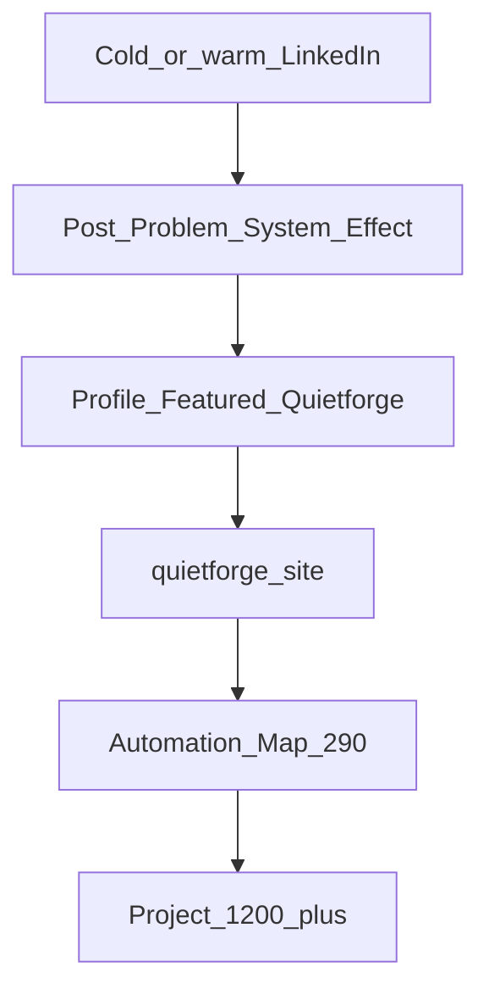

# Channel Architecture

---

## CO

Mapa **który kanał służy któremu brandowi**, z jakim CTA i czego **nie** publikować.

---

## DLACZEGO

Masz jeden ekosystem (8 repo, LOS), ale **odbiorcy są różni**: NL ZZP kupujący druk ≠ właściciel SMB szukający automatyzacji inboxu. Jeden feed „o wszystkim” obniża zaufanie i konwersję (audyt: feed = founder + investor + consumer mix).

---

## BO

Kanał bez przypisanej roli **zawsze** wraca do najłatwiejszego contentu (druk, pity, investor) — i odciąga od priorytetu A (Automation Map €290+).

Ceny i pełny ICP: [marketing-strategy.md](../marketing-strategy.md) §3, §8.

---

## Tabela kanał × brand × CTA × NIE

| Kanał | Primary brand | Secondary (proof) | Primary CTA | Język | Częstotliwość docelowa | NIE publikować |
|-------|---------------|---------------------|-------------|-------|------------------------|----------------|
| **LinkedIn** `flexgrafik-quietforge` | Quietforge B2B | FlexGrafik jako live ops | Book Automation Map → `quietforge.flexgrafik.nl/book-discovery/` | EN | ~2 posty / tydzień | Oferty druku, ceny ZZP druk, #investorready na feedzie B2B, prośby o capital w treści głównej |
| **Facebook** | FlexGrafik | Wizard jako link | Zamów / wizard / strona flexgrafik | NL (UI klienta) | wg Twojego rytmu consumer | Długie LOS / 8-repo / LangGraph |
| **TikTok** | FlexGrafik | — | Profil / link w bio | NL + krótki EN OK | short video | B2B Map, investor deck |
| **Google Business** | FlexGrafik lokal | — | Telefon / wizyta / strona | NL | aktualizacje lokalne | Quietforge pricing tiers |
| **quietforge.flexgrafik.nl** | Quietforge | FlexGrafik w /results/, /founder/ | L3 Book Map (header) | EN public | ciągły asset | Consumer print jako hero CTA |
| **zzpackage.flexgrafik.nl** | FlexGrafik product | — | Checkout wizard | NL | ciągły | — |
| **Email / DM LinkedIn** | Oba (kontekst) | — | Map lub rozmowa kwalifikacyjna | EN / NL | 1:1 | Masowe pitch bez kwalifikacji |

---

## LinkedIn — szczegółowa rola

| Element profilu | Job strategiczny | Quietforge | FlexGrafik |
|-----------------|------------------|------------|------------|
| Banner | Tożsamość + LOS diagram | Primary visual | Ecosystem proof w diagramie |
| Headline | SEO + pierwsze wrażenie | Architect @ Quietforge | Nie „drukarnia” w headline |
| About | Dual-brand story | Oferta B2B | Founder + live stack |
| Featured | Konwersja | Linki quietforge + Map + CS | Owner ecosystem jako proof |
| Activity / feed | Zasięg + narracja | Posty B2B pillars | Tylko jako case / screenshot |
| Services | Product ladder | Map + builds | Self-as-client framing |

Kontekst stanu live: audyt 2.4/5 B2B readiness — copy OK, ścieżka konwersji słaba ([linkedin-audit](./audits/linkedin-audit-2026-06-29.md)).

---

## Przepływ odbiorcy (B2B — priorytet A)

**Investor (priorytet D):** osobna ścieżka — [08-investor-track.md](./08-investor-track.md). Nie wstawiaj do tego diagramu na feedzie B2B.

---

## UTM i atrybucja (strategia)

Wszystkie linki z LinkedIn do quietforge:

`?utm_source=linkedin&utm_medium=organic&utm_campaign=<post_slug>`

**Dlaczego:** Baseline audytu: 10 profile views, 531 imp/7d — bez UTM nie wiesz, który filar dowozi ruch.

---

## NIE (anty-wzorce kanałowe)

| NIE | Kanał | Powód |
|-----|-------|-------|
| Repost consumer video z FB na LinkedIn | LinkedIn | Zły ICP; audyt: flexgrafik.nl promo 44 imp |
| Seria investor co tydzień | LinkedIn | Rozmywa priorytet A |
| Automation Map CTA na TikTok | TikTok | Zły kontekst |
| „Contact for pricing” bez linku do /pricing/ | LinkedIn Services | Drift z kanonem — audyt |
| Dwa równoległe profile LinkedIn (FlexGrafik + Quietforge) | LinkedIn | Rozdzielasz proof; utrzymuj jedno konto mostowe |

---

## UNKNOWN (Commander uzupełnia)

| Pole | Status | Do uzupełnienia |
|------|--------|-----------------|
| FB/TikTok/GMB cadence | UNKNOWN | Docelowy rytm postów consumer |
| GA4 attribution per channel | UNKNOWN | Czy osobne UTM na FB vs LI |
| Commercial traction z LinkedIn | UNKNOWN | [commercial-traction-template.md](../../operations/commander/commercial-traction-template.md) PR-08 |

---

## Powiązane

- [01-two-brand-model.md](./01-two-brand-model.md)
- [03-linkedin-principles.md](./03-linkedin-principles.md)
- [conversion-pipeline.md](../conversion-pipeline.md) — CTA tiers L1/L2/L3
