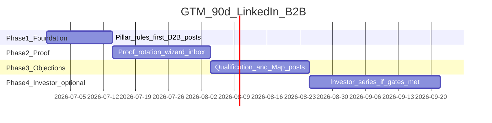

# Roadmap — 90 Days

---

## CO

Plan **fazowy** wyjścia na rynek B2B przez LinkedIn (Quietforge) — milestones strategiczne, **bez** tasków UI ani kodu.

**Horyzont:** ~13 tygodni (Q3 2026)  
**Cadence:** 2 posty / tydzień = ~26 slotów  
**Priorytet:** Track A (B2B Map → builds); Track D start earliest **Phase 4** ([08-investor-track](./08-investor-track.md))

---

## DLACZEGO

Audyt: copy profilu ~4/5, B2B readiness 2.4/5 — luka to **konsystencja treści i ścieżka**, nie rebranding. Roadmapa synchronizuje *co publikujesz kiedy*, żeby feed przestał być investor-heavy.

---

## BO

Bez faz wracasz do „jednego wiralowego posta o funding” co kwartał — zero compound trust u NL SMB.

---

## Baseline (punkt zero — 2026-06-29)

### LinkedIn

| Metryka | Wartość | Źródło |
|---------|---------|--------|
| B2B readiness score | 2.4 / 5 | [linkedin-audit](./audits/linkedin-audit-2026-06-29.md) |
| Profile views | 10 | audyt |
| Post impressions (7d) | 531 | audyt |
| Connections | 16 | audyt |
| Posty z quietforge CTA | 0 / 9 | audyt |
| Commercial traction public | UNKNOWN | [PR-08](../../operations/commander/commercial-traction-template.md) |

### Strona (homepage) — updated 2026-06-30

| Metryka | Wartość | Źródło |
|---------|---------|--------|
| Home v3.0 structure | ✅ 9 sekcji shipped | [site-map.md](../site-map.md) §3 |
| Dual-brand visible above fold | ✅ | `DualBrandBand` — Faza 1+2 |
| Featured strip (Map/results/how-it-works) | ✅ | `FeaturedStrip` |
| De-jargon hero (no 8-repo/terminal) | ✅ | Faza 1+2 commits |
| Lighthouse A11y/BP/SEO | 100/100/100 | handoff 2026-06-30 |
| Book Discovery copy match | ⏳ P0 drift | Form vs pay&slot — osobna sesja |
| Homepage ↔ LI Featured sync | ⏳ | Commander manual Featured V2 |
| LinkedIn channel canon | ✅ v3.0 | [../linkedin/README.md](../linkedin/README.md) |
| Facebook channel canon | ✅ v2.0 ZZP rebrand | [../facebook/README.md](../facebook/README.md) · [profile-copy.md](../facebook/profile-copy.md) |

### Facebook (FlexGrafik ZZP)

| Metryka | Wartość | Źródło |
|---------|---------|--------|
| Page URL | [FlexGrafik](https://www.facebook.com/people/FlexGrafik/61568401273877/) | Live audit 2026-07-01 |
| Followers | 14 | Live audit |
| Reviews | 0 | Live audit |
| Posts | 7 (last: May 2025) | Live audit |
| Pre-rebrand bio | EN “Your Graphics, Our Passion” | Live audit |
| Canon status | v2.0 shipped | profile-copy + 10-post series |
| Commander next | Paste profile · pin Post #1 | [content-themes.md](../facebook/content-themes.md) |

**Pre-v3.0 baseline (archived):** flow 7.2/10, konwersja 6.5/10 — [quietforge-ux-ia](../../audits/2026-06-25/quietforge-ux-ia.md)

---

## Fazy

---

## Phase 1 — Foundation (tyg. 1–2)

**CO:** Ustabilizować **ton B2B** na feedzie po serii 4/4 **oraz** domknąć homepage minimum (docs → kod).

**DLACZEGO:** Ostatni post widoczny = funding (216 imp) — pierwsze wrażenie cold visitor. Równolegle: landing marnuje kliknięcia (6.5/10 konwersja).

**BO:** Post B2B z Map CTA bez spójnego home = compound trust leak.

### Milestones (strategiczne)

| # | Milestone | Done when |
|---|-----------|-----------|
| **M0.1** | **GTM pack v2 Commander HITL** | README gap table zaakceptowana |
| **M0.2** | **Homepage Faza 0 (kod)** — dual-brand, Featured, de-jargon, badges | [README gap](./README.md) wiersze P0 = DONE na prod |
| **M0.3** | **Book Discovery** — jeden model (pay vs enquiry) | Copy = form behaviour |
| M1.1 | Pierwszy post **P1 Proof** (Inbox lub Wizard) opublikowany | Post live + CTA w komentarzu **+ landing pass 5s test** |
| M1.2 | Drugi post **P2 Objection** lub anti-positioning | 2× B2B z rzędu na feedzie |
| M1.3 | Wszystkie nowe posty: Problem→System→Effect | Checklist [07-playbook](./07-post-playbook.md) |
| M1.4 | UTM na linkach LI | Spójny pattern w komentarzach |
| M1.5 | LinkedIn Featured = mirror homepage Featured | Commander manual + verify URLs |

**Kolejność:** M0.1 ✅ → M0.2 ✅ → M0.3 ⏳ → M1.x posty. **Homepage minimum live — B2B posts unblocked.** Featured V2 + first post = Commander manual.

### Tydzień po tygodniu (content only)

| Tydz. | Post A | Post B | Pillar |
|-------|--------|--------|--------|
| 1 | Inbox Killer proof | Wizard self-qualify | P1, P1 |
| 2 | Anti-positioning (not chatbot) | Automation Map — co za €290 | P2, P2/P4 |

Briefy: [07-post-playbook.md](./07-post-playbook.md) #1–#4

---

## Phase 2 — Proof rotation (tyg. 3–5)

**CO:** Pokazać **szerokość** LIVE stack bez repo dump.

**DLACZEGO:** Jedna proof story = „ma tylko inbox”; potrzebujesz ladder solutions.

**BO:** Map kupują ci, którzy widzą **system**, nie jedną funkcję.

### Milestones

| # | Milestone | Done when |
|---|-----------|-----------|
| M2.1 | Min. 3 różne moduły LIVE w postach (wizard, inbox, jadzia/agent) | 3 posty P1 |
| M2.2 | Co najmniej 1× PARTIAL honesty (Jadzia) | Status label w poście |
| M2.3 | Founder P3 **max 1** post w tej fazie | Proporcje [05-pillars](./05-content-pillars.md) |
| M2.4 | Impresje / tydzień tracked | Notatka: trend vs 531/7d baseline |

### Tydzień po tygodniu

| Tydz. | Post A | Post B | Pillar |
|-------|--------|--------|--------|
| 3 | Jadzia COI PARTIAL | Trust — self-as-client 8-repo | P1, P2 |
| 4 | Lead magnet → wizard | Process — Map to handover | P1, P4 |
| 5 | Agent OS HITL (engineering layer) | Objection — EU / scoped access | P1, P2 |

Briefy: #5–#8 w playbook

---

## Phase 3 — Qualification & Map (tyg. 6–9)

**CO:** Domknąć funnel narracyjny: **dlaczego Map** → **co dalej**.

**DLACZEGO:** Po proof buyer pyta „ile i jak zacząć”.

**BO:** Bez Map story zostajesz „ciekawym founderem”, nie sprzedawcą systemów.

### Milestones

| # | Milestone | Done when |
|---|-----------|-----------|
| M3.1 | Dedicated Automation Map post + PDF sample mention | 1× P4/P2 |
| M3.2 | Min. 8 postów B2B z quietforge CTA w komentarzu | 8 cumulative |
| M3.2b | UNKNOWN: pierwszy Map booking z LI | Commander potwierdza źródło |
| M3.3 | Review proporcji pillar vs plan 40/25/20/15 | Retrospektywa 1 strona |

### Tematy (elastyczne sloty)

- Pricing integrity — link /pricing/ nie wymyślaj cyfr ([marketing-strategy §8](../marketing-strategy.md))
- Web upgrade vs wizard — qualification
- Managed automation — decay after launch
- Owner ecosystem hub — jeden deep-dive P1

---

## Phase 4 — Investor track optional (tyg. 10–13)

**CO:** Start **osobnej** mini-serii Track D — **tylko jeśli** gates spełnione.

**DLACZEGO:** Priorytet D bez Phase 1–3 = powtórka POST 4.

**BO:** Inwestor bez B2B traction story wygląda jak desperation; B2B bez inwestora OK na ten etap.

### Gates (wszystkie wymagane)

| Gate | Status |
|------|--------|
| Min. 8 postów B2B z CTA (M3.2) | Do osiągnięcia |
| Commercial traction ≥3 metryki Commander | UNKNOWN |
| Deck / one-pager investor | UNKNOWN |
| Świadoma decyzja Commander start serii D | Pending |

Jeśli gates NIE — **przedłuż Phase 3** rotacją proof; investor = DM only ([08-investor-track](./08-investor-track.md)).

---

## Metryki sukcesu 90 dni

| Metryka | Baseline | Cel strategiczny |
|---------|----------|------------------|
| B2B readiness (subiektywny audyt LI) | 2.4/5 | ≥3.5/5 |
| Homepage konwersja (audyt) | 6.5/10 | ≥8/10 |
| Homepage flow (audyt) | 7.2/10 | ≥8/10 |
| % nowych postów z Map CTA | 0% | 100% (po M0.2) |
| Mix P1–P4 vs investor | investor-heavy | ≥80% P1–P4 |
| Homepage P0 gap items | 4 open | 0 open |
| LI Featured ↔ home Featured | 0% | 1:1 mirror |
| Connections | 16 | trend ↑ (brak twardego KPI bez strategii network) |
| Map bookings attributed LI | UNKNOWN | ≥1 jeśli traction pozwala |

---

## NIE (roadmap)

| NIE | Faza |
|-----|------|
| Investor post przed M3.2 | Phase 4 gate |
| Consumer druk post „bo nie wyszło B2B” | wszystkie |
| Kasowanie serii 4/4 | wszystkie |
| Obiecywać MRR/PMF w roadmap | Phase 4 bez PR-08 |
| Taski „edytuj LinkedIn Featured” w tym dokumencie | — (osobna egzekucja) |
| **Publikować posty B2B zanim homepage będzie spójny (M0.2)** | Phase 1 — waste LI traffic |
| **LinkedIn Featured przed homepage Featured strip** | Phase 1 — rozjazd P5 |

---

## Retrospektywa (tyg. 13)

Odpowiedz na 5 pytań (notatka Commander):

1. Który pillar miał najwyższe engagement?
2. Czy ktoś przyszedł z LI na Map?
3. Czy proporcje 40/25/20/15 były realne przy 2 posty/tyg.?
4. Czy start investor series ma sens?
5. Co zmienić w [05-pillars](./05-content-pillars.md) na kolejne 90 dni?

---

## Powiązane

- [05-content-pillars.md](./05-content-pillars.md)
- [07-post-playbook.md](./07-post-playbook.md)
- [08-investor-track.md](./08-investor-track.md)
